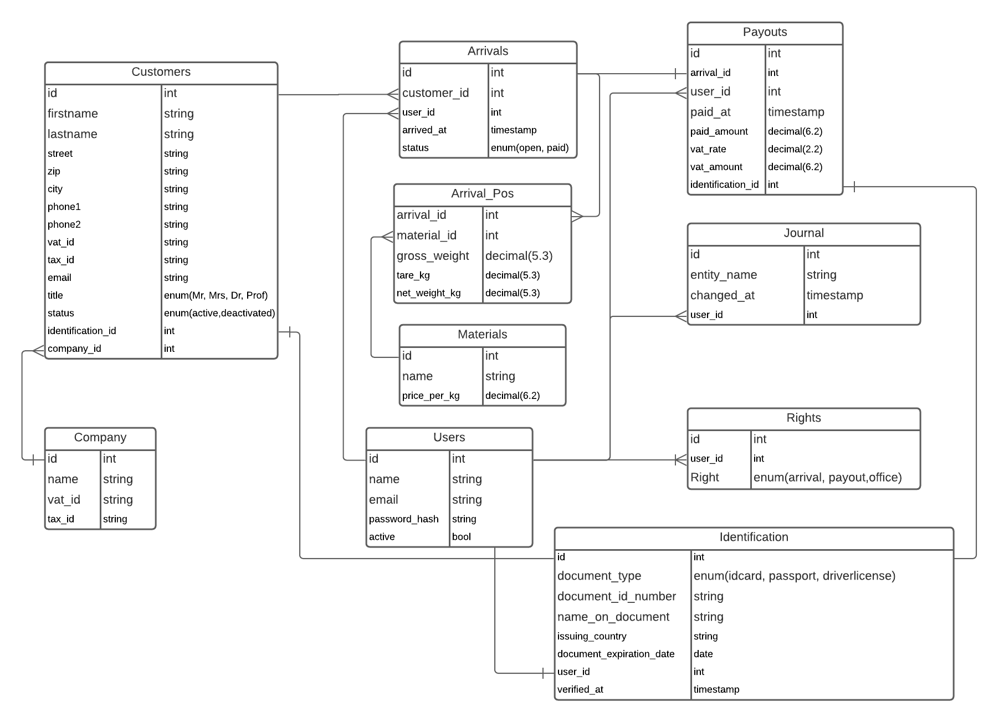

# Scrappy Application

Build Container and Application with:

```shell
make build
```

start dev server with:

```shell
make start
```

Then request http://localhost:8000/arrival (or /office or /payout) in browser on host machine


inspired by:

https://docs.djangoproject.com/en/3.1/intro/tutorial03/

https://medium.com/js-dojo/vue-django-best-of-both-frontends-701307871478

Database-Structure:
